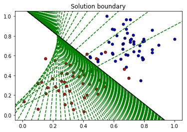

# Deep learning with PyTorch Udacity MOOC

This repository contains theory and codes based on Udacity's [Intro to deep learning with Pytorch](https://www.udacity.com/course/deep-learning-pytorch--ud188). This work is intended to be a starting point for any Deep learning project. Different topics such as neural networks, convolutional networks, recurrent networks, Autoencoders, and GANs are explained and implemented in Python. 

## Table Of Contents

The next table of content aims to briefly describe the topics in each folder of this repository. Each folder is composed by a different set of codes implemented in Python (Notebooks) and its respective theory in Tex format. 

The content of this repository is expected to by reviewed as follows.

### Introduction to Neural Networks

* [Introduction to Neural Networks](https://github.com/MikeS96/intro_deep_torch/tree/master/introduction_neural_networks): Basic theory of neural networks, the simple perceptron, backpropagation, error functions, regularization,  activation functions among others.

* [Introduction to PyTorch](https://github.com/MikeS96/intro_deep_torch/tree/master/intro_torch): Implementation of simple perceptron, multi-layer perceptrons and classification examples with Pytorch. Most of the examples were made using the MNIST and Fashion-MNIST dateset. Here is also an example of transfer learning.

### Convolutional Neural Networks

* [Convolutional Neural Networks](https://github.com/MikeS96/intro_deep_torch/tree/master/convolutional_neural_networks): Theory of Convolutional neural networks, operations and parameters. Different classification examples are given with the MNIST dataset and CIFAR10 dataset.

* [Autoencoders](https://github.com/MikeS96/intro_deep_torch/tree/master/autoencoder): In this folder is presented how autoencoders work by learning from the input data and applications as noise removal gadgets in both MLP and convolutional neural networks. In this folder is also presented the concept of upsampling and transposed convolution. 

* [Style Transfer](https://github.com/MikeS96/intro_deep_torch/tree/master/style_transfer): Here is shown how to extract style and content features from images, using a pre-trained network. This is an implementation of style transfer according to the paper, [Image Style Transfer Using Convolutional Neural Networks](https://www.cv-foundation.org/openaccess/content_cvpr_2016/papers/Gatys_Image_Style_Transfer_CVPR_2016_paper.pdf) by Gatys et. al. Define appropriate losses for iteratively creating a target. The theory and implementation are given.

### Recurrent Neural Networks

* [Intro to Recurrent Networks (Time series & Character-level RNN)](https://github.com/MikeS96/intro_deep_torch/tree/master/recurrent_neural_networks): Here are presented the recurrent neural networks and how they are able to use information about the sequence of data, such as the sequence of characters in text. Here are implemented different mini-projects such as sentiment analysis, text generation and prediction of a time series.

### Generative Adversarial Networks (GANs)

* [Generative Adversarial Network](https://github.com/MikeS96/intro_deep_torch/tree/master/gan): Presented the theory behind a GAN networks, how to train them and their potential. Different implementations are given in Pytorch with the MNIST dataset to generate digits and a Deep convolutional GAN to generate new images based on the Street View House Numbers (SVHN) dataset.

### Miscellaneous

* [Miscellaneous](https://github.com/MikeS96/intro_deep_torch/tree/master/miscellaneous): Here are given two notebooks related to weight initialization and their effects during training and batch normalization to improve training rates and stability.

**Note** All the codes were taken from the Udacity MOOC as mentioned above. Some codes were slightly modified and others are just the solution proposed by the mentor. The idea is to have a group of codes and theory ready to use with any AI-related project.

